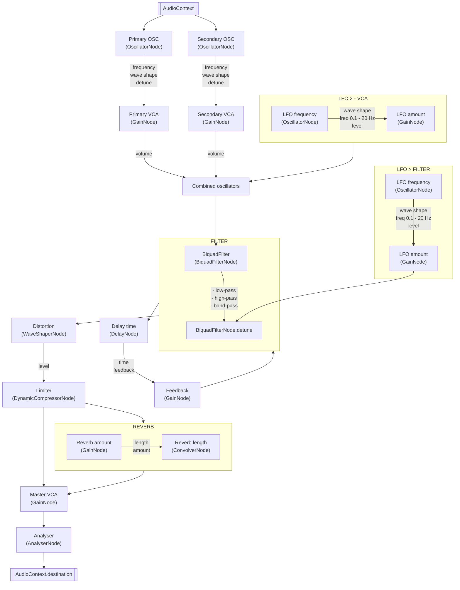

# SynthJS

Monophonic synthesizer based on JavaScript Web API AudioContext.

## Features:
- 2 oscillators
- 4 wave shapes 
  - sine
  - sawtooth
  - square
  - triangle
- 3 filters with Frequency and Quality Factor
  - LP - Low pass
  - HP - High pass
  - BP - Band pass
- ADSR envelope generator / gate switch 
- 2 LFO's for OSC Detune and Master VCA
- distortion with one algorithm
- effects
  - delay - time and feedback
  - reverb - length and amount
- master VCA
- live wave shape analyser
- playable keyboard with UI
- current note with Hz frequency

## Nodes connection diagram

## Available Scripts

### `yarn start`

Runs the app in the development mode.\
Open [http://localhost:3000](http://localhost:3000) to view it in the browser.

### `yarn build`

Builds the app for production to the `build` folder.\
It correctly bundles React in production mode and optimizes the build for the best performance.
