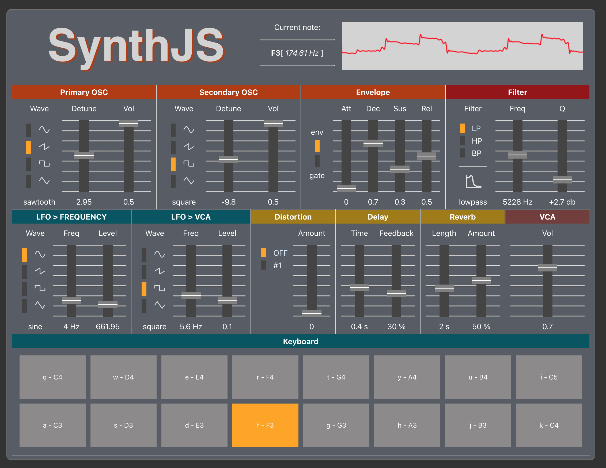

# SynthJS

Monophonic synthesizer based on JavaScript Web API AudioContext.



## Features:
- 2 oscillators
- 4 wave shapes 
  - sine
  - sawtooth
  - square
  - triangle
- 3 filters with Frequency and Quality Factor
  - LP - Low pass
  - HP - High pass
  - BP - Band pass
- ADSR envelope generator / gate switch 
- 2 LFO's for OSC Detune and Master VCA
- distortion with one algorithm
- effects
  - delay - time and feedback
  - reverb - length and amount
- master VCA
- live wave shape analyser
- playable keyboard with UI
- current note with Hz frequency

## Nodes connection diagram

```mermaid
flowchart TD
    AUDIO_CTX[[AudioContext]]
        AUDIO_CTX --> OSC_1
        AUDIO_CTX --> OSC_2
    OSC_1["Primary OSC\n(OscillatorNode)"] -- "- frequency\n- wave shape\n- detune" --> VCA_1["Primary VCA\n(GainNode)"] --> BIQUAD_FILTER
    OSC_2["Secondary OSC\n(OscillatorNode)"] -- "- frequency\n- wave shape\n- detune"--> VCA_2["Secondary VCA\n(GainNode)"] --> BIQUAD_FILTER
   
    subgraph FILTER
        BIQUAD_FILTER["BiquadFilter\n(BiquadFilterNode)"] -- "- low-pass\n- high-pass\n- band-pass" -.- DETUNE[\BiquadFilterNode.detune/]
    end

    subgraph LFO__1
        LFO_1["LFO frequency\n(OscillatorNode)"] -- "0.1 - 20 Hz" --> LFO_1_GAIN["LFO amount\n(GainNode)"] --> DETUNE
    end
    
    FILTER --> DISTORTION["Distortion\n(WaveShaperNode)"] --> LIMITER["Limiter\n(DynamicCompressorNode)"]
    FILTER --> DELAY["Delay time\n(DelayNode)"] -- "0 - 1 s" --> DELAY_FEEDBACK["Feedback\n(GainNode)"] --> FILTER
    LIMITER --> MASTER_VCA["Master VCA\n(GainNode)"]
    LIMITER --> REVERB
   
    subgraph REVERB
        REVERB_GAIN["Reverb amount\n(GainNode)"] --> REVERB_CONVOLVER["Reverb length\n(ConvolverNode)"]
    end    
    
    REVERB --> MASTER_VCA
    
    subgraph LFO__2
        LFO_2["LFO frequency\n(OscillatorNode)"] -- "0.1 - 20 Hz" --> LFO_2_GAIN["LFO amount\n(GainNode)"] 
    end LFO__2 --> MASTER_VCA
   
    MASTER_VCA --> ANALYSER["Analyser\n(AnalyserNode)"]
    ANALYSER --> CTX_DESTINATION[[AudioContext.destination]]
```

## Available Scripts

### `yarn start`

Runs the app in the development mode.\
Open [http://localhost:3000](http://localhost:3000) to view it in the browser.

### `yarn build`

Builds the app for production to the `build` folder.\
It correctly bundles React in production mode and optimizes the build for the best performance.
